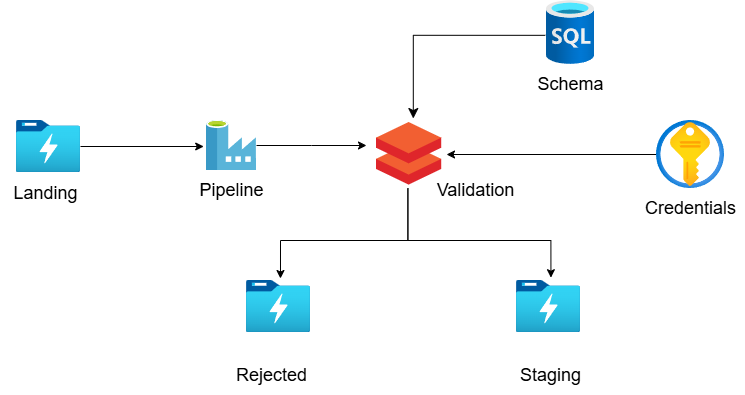

# AP Morgan (Project on Azure Cloud)
## Description

## Architecture

## Dataset preview  

## Approach  
➡Internal Application sends CSV file in Azure Data Lake Storage.  
➡Validation needed to apply on this follows:  
  ✔Check for duplicate rows. If it contains duplicate rows, file needs to be rejected.  
  ✔Need to validate the date format for all the date fields. Date column names and desired date format is stored in an Azure SQL Server. If validation fails, file        will be rejected.  
➡Move all the rejected files to the Reject folder.  
➡Move all the passed files to the Staging folder.  
➡Write the passed files as a Delta table in Azure Databricks.  

## Azure Services Used:  
✅ DataBricks    
✅ DataFactory  
✅ Azure Data Lake Storage   
✅ Key Vault  
✅ Azure SQL  
