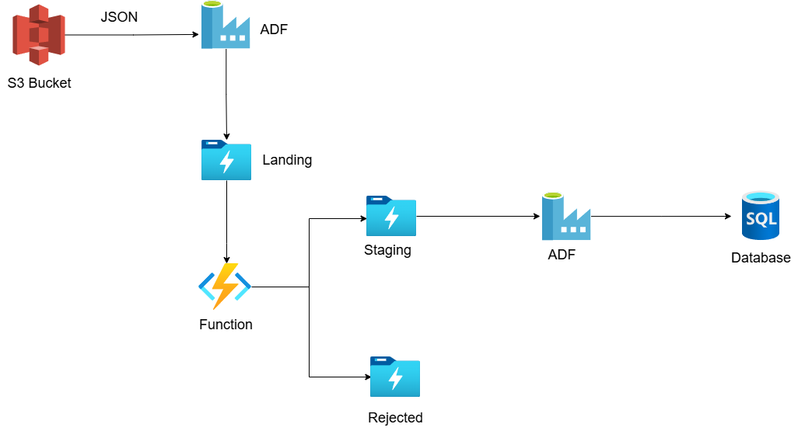

# Connected Vehicle (Project on Azure Cloud)
## Description  
The **Connected Vehicle Project** processes real-time vehicle tracking data from JSON files stored in an **AWS S3 Bucket**. The data is ingested using **Azure Data Factory (ADF)** and stored in the **Landing folder** in Azure Data Lake Storage. An **Azure Function** validates the data based on schema rules.  

- **Valid data** is moved to the **Staging folder** and later loaded into an **Azure SQL Database** via ADF for analysis.  
- **Invalid data** is sent to the **Rejected folder** for further review.  

This architecture ensures efficient data ingestion, validation, and storage for connected vehicle analytics. 🚀  

## Architecture

## Raw Data Information (Vehicle Data)  
This project processes vehicle tracking data in JSON format. The data includes details such as Vehicle ID, latitude, longitude, city, temperature, and speed. The raw data is stored in Azure Data Lake Storage, and is further processed using Azure Data Factory and Azure Databricks.  

JSON Data Structure:
| Column Name   | Data Type  | Description |
|--------------|-----------|-------------|
| **VehicleID**  | String | Unique identifier for the vehicle. |
| **Latitude**   | Float  | Geographical latitude of the vehicle. |
| **Longitude**  | Float  | Geographical longitude of the vehicle. |
| **City**       | String | City where the vehicle is located. |
| **Temperature** | Integer | Recorded temperature at the vehicle's location (°F). |
| **Speed**      | Integer | Speed of the vehicle (km/h). |

## Approach for Connected Vehicle Project:   
1. **Ingest JSON Data from S3 Bucket**  
   - JSON files containing vehicle tracking data are stored in an **AWS S3 Bucket**.  
   - **Azure Data Factory (ADF)** pulls these files into the **Landing folder** in Azure Data Lake Storage.  

2. **Data Validation using Azure Function**  
   - An **Azure Function** validates the ingested JSON data.  
   - Validation checks include:  
     - **Schema validation** (ensuring required fields exist).  
     - **Data quality checks** (e.g., correct data types, no missing values).  

3. **Processing and Staging**  
   - Valid JSON files are moved to the **Staging folder** in Azure Data Lake Storage.  
   - Invalid/rejected files are moved to the **Rejected folder** for further analysis.  

4. **Loading into SQL Database**  
   - Staged data is processed and transformed using **ADF pipelines**.  
   - The cleaned and validated data is then loaded into an **Azure SQL Database** for further analysis and reporting.

## Azure Services Used: 
✅ Azure Data Lake Storage Gen 2  
✅ Azure Data Factory  
✅ Data Factory Pipeline  
✅ Azure Functions  
✅ Azure Key Vault   
✅ AWS S3 Bucket     
✅ Connect S3 to Azure Cloud  
✅ Triggers   
✅ Store secretes in Key Vault and access them 
