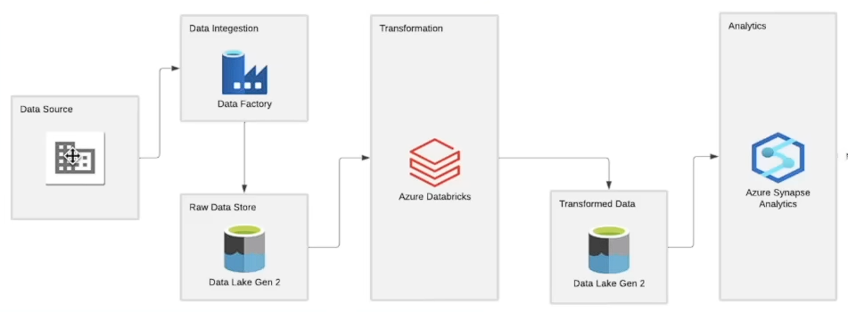

# Tokyo-Olympic (Project on Azure Cloud)

## Description
Building Data Pipelines in Azure with Azure Synapse Analytics.  
My purpose in building this project is to gain hands-on experience in executing a data engineering project using Azure cloud services.
In this Microsoft Azure Data Engineering Project, I learned learn how to build a data pipeline using Azure Synapse Analytics, Azure Storage and Azure Synapse SQL pool to perform data analysis on the 2021 Olympics dataset.

## Architecture

## Dataset preview  
For this project, I will be working with the 2021 Olympics dataset. This includes the information on more than 11,000 athletes competing in 47 sports for 743 Teams in the Tokyo Olympics in 2021. This dataset includes information on the participating Teams, Athletes, Coaches, and Entries by gender. It includes their names, nationalities, sports they compete in, and name of coaches.  
The dataset contains 5 files as follows:    
1. Athletes.xlsx (Details about Athletes)      
2. Coaches.xlsx (Details about coaches, countries and disciplines along with event)  
3. EntriesGender.xlsx (Details about the Discipline and the number of females and males participating)  
4. Medals.xlsx (Contains the Medals and Scoreboard of countries that participated in Olympics)    
5. Teams.xlsx (Details about the Teams, discipline, Name of Country and the event)  

Dataset Link: https://www.kaggle.com/datasets/arjunprasadsarkhel/2021-olympics-in-tokyo
## Steps:
➡ Downloaded dataset from the above link and uploaded to amazon s3 bucket to replicate real world scenario.  
➡ Used Databricks platform to efficiently write pySpark code without worrying about compute resources. Connected my s3 bucket to databricks notebook to use all 
   the dataset files.  
➡ Explored all the available tables, cleaned it, and transformed them according to our requirements to make them more sensible. This makes it easier to fetch 
   insights without worrying about any anomaly in the data.  
➡ Converted all the transformed datasets into sql table to query efficiently.  
➡ Performed queries and plotted graph to draw insights.

### Queries performed to get answers for the following questions:     
|Query|Description|
|-----|-----------|
|Q1|Top scoring batsman per season.|
|Q2|Impact of Winning Toss on Match Outcome.|
|Q3|Scores by Venue.|
|Q4|Team Performance After Winning Toss.|
|Q5|Number of Wins Per Team Per Season.|

## Learnings
✔ Python & PySpark  
✔ SQL  
✔ Apache Spark Basics and Databricks  
✔ Writing transformation logic  
✔ Visuallizing data for insights

